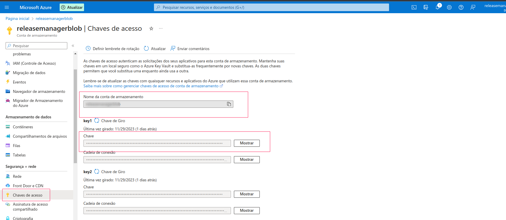
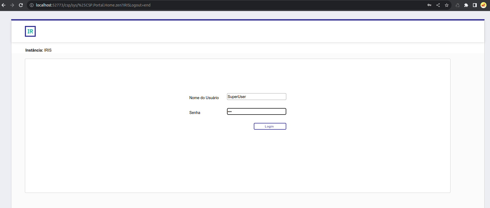

# Release Manager

Submitted to InterSystems Java Contest 2023

## Team

The team of this project is:

- [Cesar Cruz](https://github.com/cesarbcruz)
- [Higor Granzoto](https://github.com/higorrg)

## Context

Release Manager is a tool to manage software release to the market using Canary Release methodology.

In this solution, we’re relying on [InterSystems IRIS Data Platform](https://www.intersystems.com/data-platform/), specifically on the [Interoperability](https://www.intersystems.com/data-platform/interoperability/) capabilities, to give the flexibility and easiness of a no-code approach for integration with cloud storage vendors.

We understand Canary Release as defined in [Martin Fowler’s](https://martinfowler.com/) blog from ThoughtWorks called [“Canary Release” by Danilo Sato.](https://martinfowler.com/bliki/CanaryRelease.html)

> **Canary release** is a technique to reduce the risk of introducing a new software version in production by slowly rolling out the change to a small subset of users before rolling it out to the entire infrastructure and making it available to everybody.
> 

Although we have cloud based customers, we also have on premises too, so we need to be expanded the word “infrastructure” from the definition above, to fit in our solution.

## Business Problem

Given that a software development team want to release features to the market, in a Canary Release way, we have come up with the Event Storming below.


## Business Solution

Facing a DevOps challenge, that pinpoint key stages of the process, we selected only those one that can help provide metrics of improvement, as the DevOps mindset is all about Agile development methodology, and there are maturity models like [DORA](https://dora.dev/research/), that can be used.

Mostly we want to help measure and improve one of the [Four Key Metrics](https://cloud.google.com/blog/products/devops-sre/using-the-four-keys-to-measure-your-devops-performance), the **Deployment frequency**, which stands for: How often does your organization deploy code to production or release it to end users?

The key thing about these metric that we wanna to state is that, we have to measure delivery failures to be able to improve, not just how often we delivery, but how often we deliver with quality, focusing on the reduction of the number of times a version doesn’t go up to the promotion of general availability.

There are five status that a product version can be promoted by the release manager role, a person with this specific authority.

### Version Status

1. Internal: The development team are asking to go to market
2. Canary: The release manager role is promoting that version to a subset of customers
3. GA - General Availability: The release manager role is promoting a version to all customers
4. Revoked: The release manager role found problems on a given version and will not promote it to the market
5. Deprecated: The release manager role is removing a given product version from the market as it reached its end of life phase, and there is a new major version available to the market.

For that, we want register metrics like:

- Frequency of delivery.
- Frequency of Internal versions that are not promoted to Canary.
- Frequency of Canary versions that are not promoted to General Availability.
- Successful Deployment by Product
- Deployments In Progress
- Median Download Time Interval by Customers
- Median Deployment Time Interval by Customers
- Etc.

## Architectural Solution

### System Context


The diagram above, shows the system context using the C4 modeling notation. Here we present the high level context for the solution landscape.

There are five basic roles involved, starting with the developer and ending with the user that needs its software to be upgraded.

Along the way, there are the Release Manager role, in which have the authority to promote the version status as described in [Version Status section](#Version%20Status). There are, also, any stakeholder interested in been notified about version status promotion. And finally a system administrator who have the authority to change the system configuration.

For external system involved with this solution we have the SCM Git repository, or any other form of SCM - Software Configuration Management, CI/CD tools, that perform the delivery to this system.

Hence, the Release Manager solution is a delivery system.

### Software Containers for Java and InterSystems Technology


As we can see in the diagram above, where we present the containers as per the C4 modeling notation, we’re relying on [InterSystems IRIS Data Platform](https://www.intersystems.com/data-platform/), specifically on the [Interoperability](https://www.intersystems.com/data-platform/interoperability/) capabilities, to give the flexibility and easiness of a no-code approach for integration with cloud storage vendors, and also InterSystems ZPM/IPM repository. Because, by the other way, we would need to interact with all other cloud vendors SDK and create a bigger and complex architecture.

The complexity would increase with:

- More tables in the database
- More classes
- More abstractions
- More configuration files
- More security concerns
- More observability capabilities
- More resilience implementations

## Running the InterSystems IRIS Data Platform

InterSystems [IRIS](https://www.intersystems.com/data-platform/) is a high-performance database that powers transaction processing applications around the world.

```bash
docker network create release-manager-net
docker run --rm --name release-manager-iris \
	--network=release-manager-net \
	-p 1972:1972 \
	-p 52773:52773 \
	intersystemsdc/iris-community:2023.2-zpm
```

Open http://localhost:52773/csp/sys/UtilHome.csp to change the password.

```bash
Username: SuperUser
Change password from SYS to admin
```

# The Java Backend

This project uses Quarkus, the Supersonic Subatomic Java Framework. A Kubernetes Native Java stack tailored for OpenJDK HotSpot and GraalVM, crafted from the best of breed Java libraries and standards.

If you want to learn more about Quarkus, please visit its website: https://quarkus.io/ .

## Configuration

Before start the Java backend, you need to inform what is your IRIS password to it.

You can provide it on the property `quarkus.datasource.password` in the `application.properties` file located at `src/main/resources`, or the environment variable `QUARKUS_DATASOURCE_PASSWORD` if you use the docker image.

## Running the Backend in Dev Mode

### Prepare dependencies

This application was built using [Apache Maven 3.9.5](https://maven.apache.org/download.cgi) and [Java 17](https://javaalmanac.io/jdk/17/).

We recommend using [SDK Man](https://sdkman.io/). After installing SDK Man, you can install a Java 17 distribution, Maven and Quarkus CLI.

```bash
sdk install maven
sdk install java 17.0.8-sem
sdk install quarkus

#From the backend directory run:
quarkus dev
```

This project already contains InterSystems jar files needed at `src/main/resources/lib`.

InterSystems Java technologies are not available on Maven Central, so you need to get JDBC connectors and other jar files from https://intersystems-community.github.io/iris-driver-distribution/.

In order to build this project, go to the `Backend` root folder and type:

```
mvn install:install-file -Dfile=${PWD}/src/main/resources/lib/intersystems-jdbc-3.7.1.jar -DgroupId=com.intersystems -DartifactId=intersystems-jdbc -Dversion=3.7.1 -Dpackaging=jar
```

You can run the application in dev mode using Quarkus CLI:

```bash
quarkus dev
```

You can run the application in dev mode using Maven:

```bash
./mvnw compile quarkus:dev
```

Quarkus ships with a Dev UI, which is available in dev mode only at http://localhost:8080/q/dev/. There, you can explore all extensions and configurations of the application.

## Packaging the application in container

The application can be packaged for containers using:

`./mvnw package -Dquarkus.native.container-build=true`

```bash
docker run --rm --name release-manager-backend \
  --network=release-manager-net \
  -p 8080:8080 \
  --env QUARKUS_DATASOURCE_JDBC_URL=jdbc:IRIS://release-manager-iris:1972/USER \
  --env QUARKUS_DATASOURCE_PASSWORD=yourPassword \
  releasemanager/backend:latest
```

## Playing with the application

Nether way, by running in dev mode or running the container image, now you can play around with the application by accessing the main page at http://localhost:8080/

There, you will find the notification panel, and a link to the [Swagger-UI](http://localhost:8080/q/swagger-ui/), where you can send HTTP requests and observe the notification panel react using [SSE - Serven-Sent Events](https://developer.mozilla.org/en-US/docs/Web/API/Server-sent_events).

## InterSystems IRIS Interoperability (Cloud Storage)
This is an example of interoperability that performs file transfers to a [cloud storage service](https://docs.intersystems.com/healthconnectlatest/csp/docbook/DocBook.UI.Page.cls?KEY=ECLOUD).

### What this example does

This application receive a http multipart request with a file and saves to Azure Blob 

### Prerequisites
1. Make sure you have [Docker](https://www.docker.com) installed.

2. It will also be necessary to have a cloud storage account compatible with IRIS Interoperability, such as Amazon Web Services (AWS), Azure Blob Storage (Azure), or Google Cloud Platform (GCP).


### Installation: Docker

1. First, modify the file [cloudstoragecredential](../interoperability/cloudstoragecredential) with the credentials of the cloud storage service, for example using Azure Blob:
```
DefaultEndpointsProtocol=https
AccountName=YOUR_ACCOUNT_NAME
AccountKey=YOUR_ACCOUNT_KEY
EndpointSuffix=core.windows.net
```


2. Make sure you did run steps on [Running the InterSystems IRIS Data Platform](#Running%20the%20InterSystems%20IRIS%20Data%20Platform) above in this document.

### How to Run the Sample

1. Open the [production](http://localhost:52773/csp/irisapp/EnsPortal.ProductionConfig.zen?PRODUCTION=dc.upload.UploadProduction) in the IRIS Administration Portal (login: SuperUser and password: SYS).

 
2. Start the production.


3. Check the cloud storage configuration in the business operation and ensure that the credentials file is properly selected.


4. Now Open Postman and create a multipart request into a form-data pointing to localhost:9980/ using verb POST. See sample:


5. After executing the request, verify if the file has been correctly sent to the previously registered Azure Blob.

